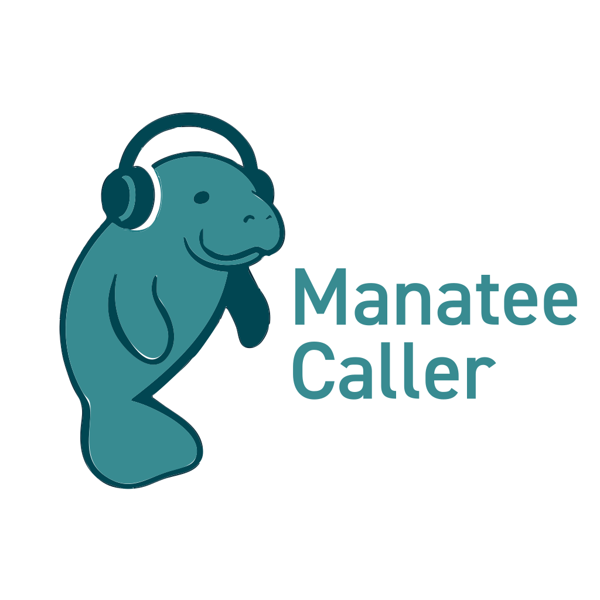

<p align="center">
  
</p>

<p align="center">
  
  
  
</p>

# 🧜 ManateeCaller

**ManateeCaller** is a creative Node.js-based telephony art experiment—designed especially for **manatee owners, lovers, and enthusiasts**. It uses **text-to-speech (TTS)** and **phone calls** to turn their spoken feelings into **color mosaics**. Think of it as voice-triggered generative art for gentle sea cow admirers.

---

## 🚀 What It Does

1. **Takes your text** and uses **ElevenLabs** to generate an MP3.
2. **Calls a phone number** (only those of verified manatee enthusiasts) via **Twilio**, playing that MP3.
3. **Records the callee’s spoken response**, transcribes it.
4. **Hashes the text into a hex color code** (like `#ff5733`).
5. **Displays those colors** as a growing HTML mosaic of all calls so far.

---

## 🔧 REST API Endpoints

| Endpoint | Description |
|----------|-------------|
| `POST /generate-tts` | Generate MP3 from text (returns `audio_url`) |
| `POST /make-call` | Call a number and play the MP3 |
| `POST /call-webhook` | Twilio webhook to return TwiML (MP3 + record/transcribe) |
| `POST /transcript-webhook` | Receive transcript from Twilio, convert to hex color |
| `GET /artwork` | View HTML mosaic of all captured color codes |

---

## 🗃️ Example JSON Inputs

### Generate TTS
```json
POST /generate-tts
{
  "text": "Hello, your colors await!"
}
```

### Make a Call
```json
POST /make-call
{
  "phoneNumber": "+1234567890",
  "audioUrl": "https://example.com/audio.mp3"
}
```

---

## 🌈 How Color Codes Work

The transcript from the phone call is hashed using a simple algorithm (e.g., SHA-256 or MD5). The first 6 hex digits of the hash become the color code. For example:

```
"today I feel blue" → hash → #7ac9d2
```

---

## 📦 Setup & Run Locally

### Requirements

- Node.js 18+
- A Twilio account
- An ElevenLabs API key
- Ngrok (for local Twilio webhooks)

### .env File
```
PORT=3000
TWILIO_ACCOUNT_SID=...
TWILIO_AUTH_TOKEN=...
TWILIO_NUMBER=+1234567890
ELEVENLABS_API_KEY=...
ELEVENLABS_DEFAULT_VOICE=optional-voice-id
```

### Install & Run
```bash
npm install
npm start
```

---

## 🗺️ Roadmap

### ✅ MVP / Core Functionality
- [x] Text to MP3 (via ElevenLabs)
- [x] Outbound call with Twilio
- [x] Record/transcribe user response
- [x] Convert to hex color code
- [x] Render mosaic in browser

### 🧪 Improvements
- [ ] Replace in-memory storage with SQLite/PostgreSQL
- [ ] Paginated mosaic view
- [ ] Authenticated sessions & call history
- [ ] Download mosaic as image

### 🎨 Future Fun
- [ ] Web UI for triggering TTS + calls
- [ ] Artwork themes (e.g., gradients, pixelation)
- [ ] Social sharing features

---

## 🛠️ Tech Stack

- **Node.js / Express**
- **Twilio Programmable Voice**
- **ElevenLabs Text-to-Speech API**
- **HTML/CSS Mosaic UI**

---

## 💸 Funding & Support

**ManateeCaller** is currently seeking our first wave of **manateeAngel investors** — aquatic-minded patrons who believe in the power of voice, tech, and tenderness.

If you or your organization are interested in supporting:
- Marine-inspired art-tech hybrids 🐚
- Peaceful voice-based communication 🌀
- Cold-calling, color-converting sea cow poetry 📞🎨

Then we’d love to chat. Please reach out via our project contact channels or raise a flipper via GitHub issues.

🪙 *Small ripples make big waves.*


---

## 📄 License

MIT – Use freely, remix boldly.
